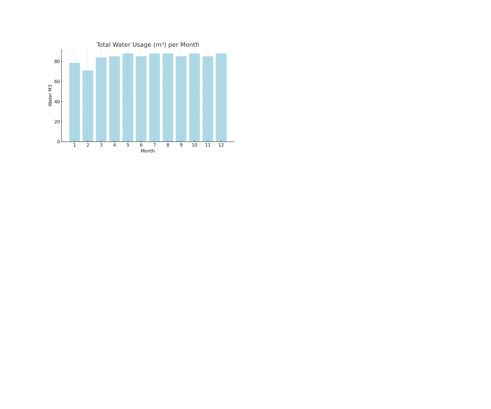
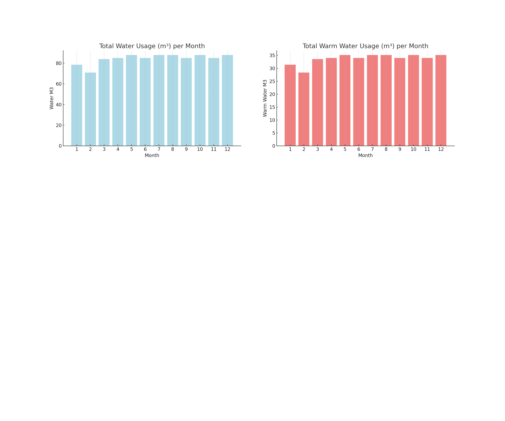
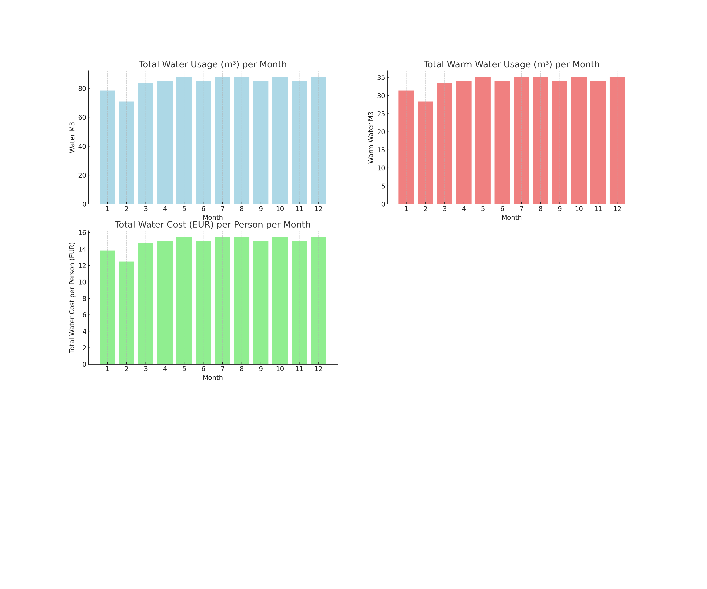
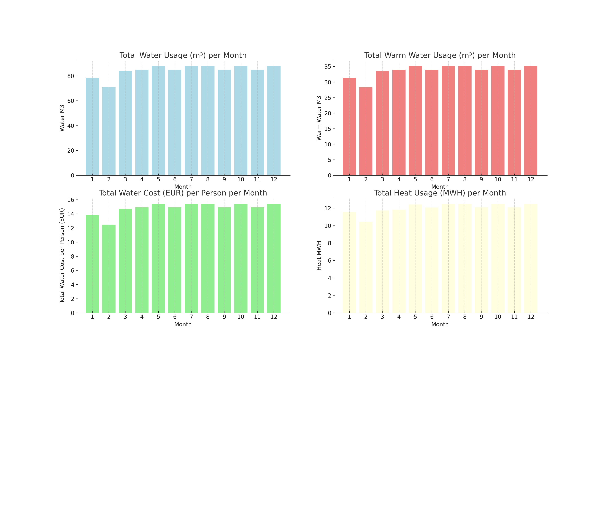
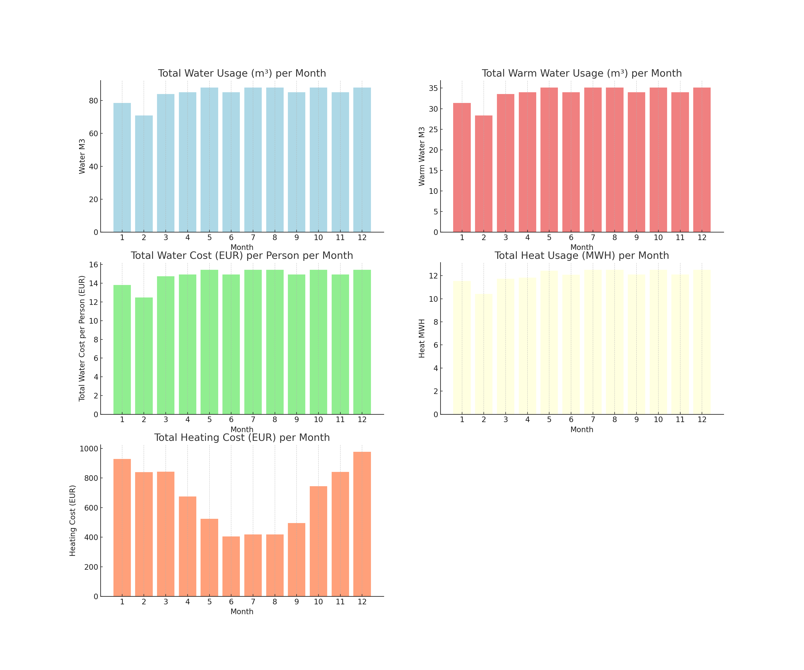

Vesisahko Water & Heating Analysis
==================================

This project provides an analysis of water and heating consumption for an apartment complex for the year 2023.

Methodology:
------------
1. The dataset provided contained daily readings for water consumption (in m³) and heating (in MWH) for the months of June, July, and August 2023.
2. Missing values were imputed using the forward-fill method.
3. Outliers in the dataset were detected and removed using the IQR method. 
4. An ARIMA (AutoRegressive Integrated Moving Average) model was applied to forecast water and heating consumption for the entire year. 
Used Arima parameters (1,1,2).
Tested Arima hyper parameters (0,1,1) are https://en.wikipedia.org/wiki/Exponential_smoothing that should balance out cyclic data.
5. Costs associated with water and heating consumption were calculated based on given monthly rates.
6. The data was further enhanced with simulated warm water consumption and associated costs.
7. Finally, the dataset was aggregated on a monthly level for easier interpretation and visualization.

Setup Instructions:
-------------------
1. Ensure you have Python 3.7+ installed.
2. Clone this repository to your local machine.
3. Navigate to the project directory.
4. Install the required Python packages using the command: `pip install -r requirements.txt`
5. Run the analysis script using the command: `python analysis.py`

Note: This analysis is based on simulated and extrapolated data. Actual consumption and costs may vary.

Visualizations:
---------------
1. 
2. 
3. 
4. 
5. 
