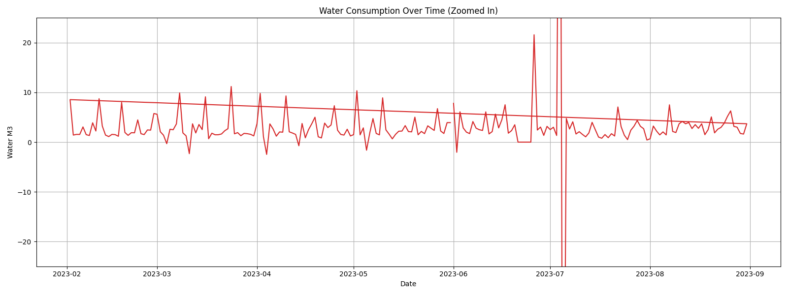
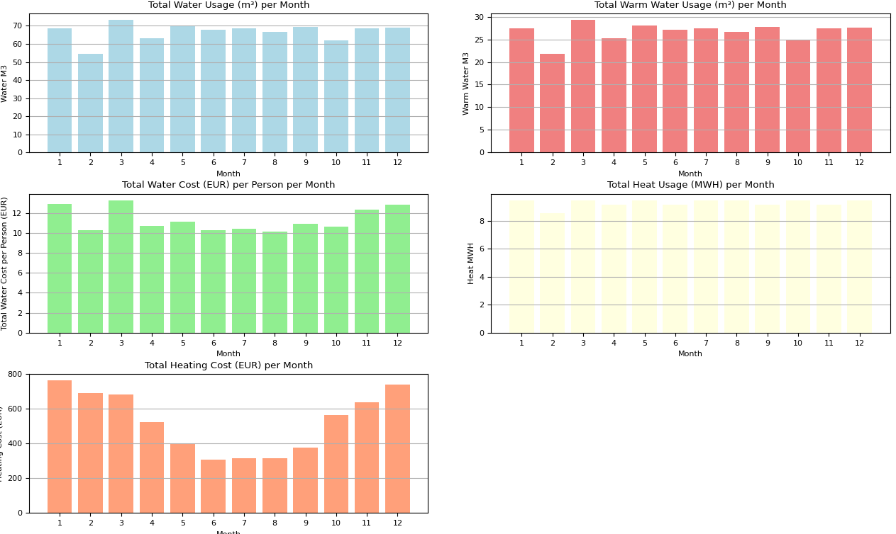

 Water & Heating Analysis townhouse appartment complex
==================================

This project provides an analysis of water and heating consumption for an townhouse appartement complex for the year 2023.

Methodology:
------------
1. The dataset provided contained daily readings for water consumption (in m³) and heating (in MWH). Heating is for the months of June, July, and August 2023. Water consumption is from February to August 2023.
2. Missing values were imputed using the forward-fill method.
3. Outliers in the dataset were detected and removed using the IQR method. 
4. An ARIMA (AutoRegressive Integrated Moving Average) model was applied to forecast water and heating consumption for the entire year. 
Used Arima parameters (10,1,0). MA is 0 as assumed that errors have no significant dependence. AR 10 as we want to extrapolate past to future.
Tested Arima hyper parameters (0,1,1) are https://en.wikipedia.org/wiki/Exponential_smoothing that should balance out cyclic data.
5. Costs associated with water and heating consumption were calculated based on given monthly rates.
6. The data was further enhanced with simulated warm water consumption and associated costs.
7. Finally, the dataset was aggregated on a monthly level for easier interpretation and visualization.

Visualizations:
---------------
1. 
2. 
3. 
4. 
Results:
-------
1. 

Formulas and variables:
---------

Total Number of Person living in NK 9-11 = 30
Warm water use = Total water per day used * 0.40 (Motiva 40% guidelines)

Water price per M3 = 3.7696 (Fresh water + waste water, including VAT)

Heating cost for 1 MWH = Varies per MWH between different months per year. Prices include VAT {1: 80.6, 2: 80.6, 3: 71.92, 4: 57.04, 5: 42.16, 6: 33.48, 7: 33.48, 8: 33.48, 9: 40.92, 10: 59.52, 11: 69.44, 12: 78.12}

Cold water cost = Water use * Water price per M3
Warm water heating cost = Warm water use M3 * 0.058 (0.058 MWH to heat one M3)  * Heating price for each month (calculate for each day of year separately)
Total Water cost = Warm water heating cost + Cold water cost

                                               

Setup Instructions:
-------------------
1. Ensure you have Python 3.7+ installed.
2. Clone this repository to your local machine.
3. Navigate to the project directory.
4. Install the required Python packages using the command: `pip install -r requirements.txt`
5. Run the analysis script using the command: `python analysis.py`

Note: This analysis is based on simulated and extrapolated data. Actual consumption and costs may vary.

